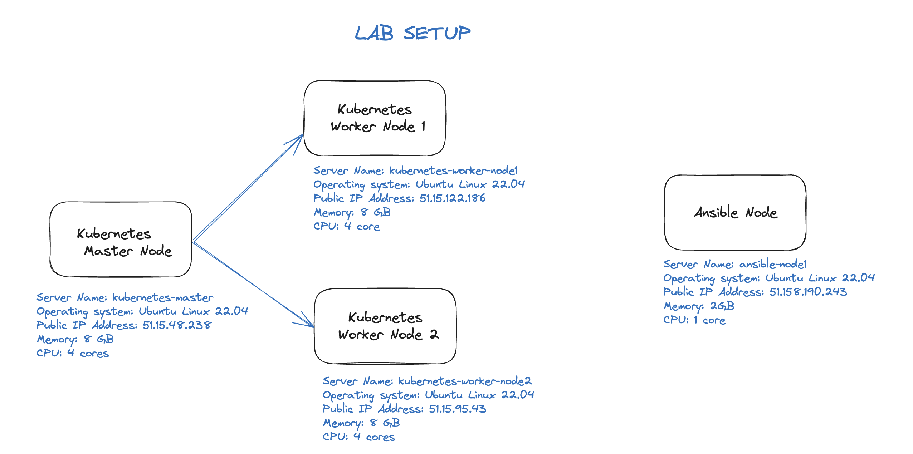
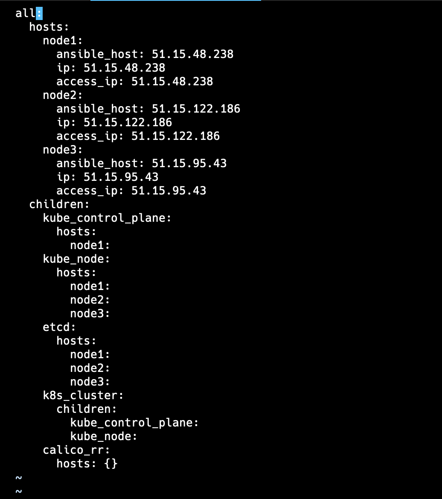

# kubernetes-kubespray-ansible

This repository is a tutorial how to create a Kubernetes cluster with Kubespray. Kubernetes cluster will have 1 master node and 2 workers nodes.
This will work on physical servers, virtual machines, AWS cloud, Google cloud, Scaleway cloud or any other cloud servers. This has been tested and verified on Ubuntu 22.04 Jammy Jellyfish operating systems. 

# WHAT IS KUBESPRAY?
Kubespray is an application that allows us to create kubernetes clusters by using ansible on our private servers or cloud servers (such as Scaleway).


# LAB Setup



## Step 1) Configure Kubespray/Ansible Node
Login to your Ubuntu 22.04 system and install ansible. Run the following set of commands:

```bash
sudo apt update
sudo apt install git python3 python3-pip -y
git clone https://github.com/kubernetes-incubator/kubespray.git
cd kubespray
pip install -r requirements.txt
```


Verify the ansible version, run
```bash
ansible --version

ansible [core 2.14.10]
  config file = /Users/x/Documents/CJIB/kubespray/ansible.cfg
  configured module search path = ['/Users/x/Documents/CJIB/kubespray/library']
  ansible python module location = /opt/homebrew/lib/python3.11/site-packages/ansible
  ansible collection location = /Users/x/.ansible/collections:/usr/share/ansible/collections
  executable location = /opt/homebrew/bin/ansible
  python version = 3.11.5 (main, Aug 24 2023, 15:09:45) [Clang 14.0.3 (clang-1403.0.22.14.1)] (/opt/homebrew/opt/python@3.11/bin/python3.11)
  jinja version = 3.1.2
  libyaml = True
```

Create the hosts inventory, run below commands and don’t forget to replace IP address that suits to your deployment.
```bash
cp -rfp inventory/sample inventory/mycluster
declare -a IPS=(51.15.48.238 51.15.68.137 51.15.122.186 51.15.95.43)
CONFIG_FILE=inventory/mycluster/hosts.yaml python3 contrib/inventory_builder/inventory.py ${IPS[@]}

DEBUG: Adding group all
DEBUG: Adding group kube_control_plane
DEBUG: Adding group kube_node
DEBUG: Adding group etcd
DEBUG: Adding group k8s_cluster
DEBUG: Adding group calico_rr
DEBUG: adding host node1 to group all
DEBUG: adding host node2 to group all
DEBUG: adding host node3 to group all
DEBUG: adding host node4 to group all
DEBUG: adding host node1 to group etcd
DEBUG: adding host node2 to group etcd
DEBUG: adding host node3 to group etcd
DEBUG: adding host node1 to group kube_control_plane
DEBUG: adding host node2 to group kube_control_plane
DEBUG: adding host node1 to group kube_node
DEBUG: adding host node2 to group kube_node
DEBUG: adding host node3 to group kube_node
DEBUG: adding host node4 to group kube_node
```

Modify the inventory file, set 1 control nodes and 2 worker nodes
```bash
vi inventory/mycluster/hosts.yaml
```

