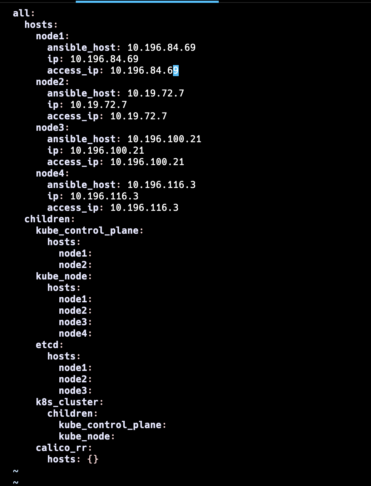
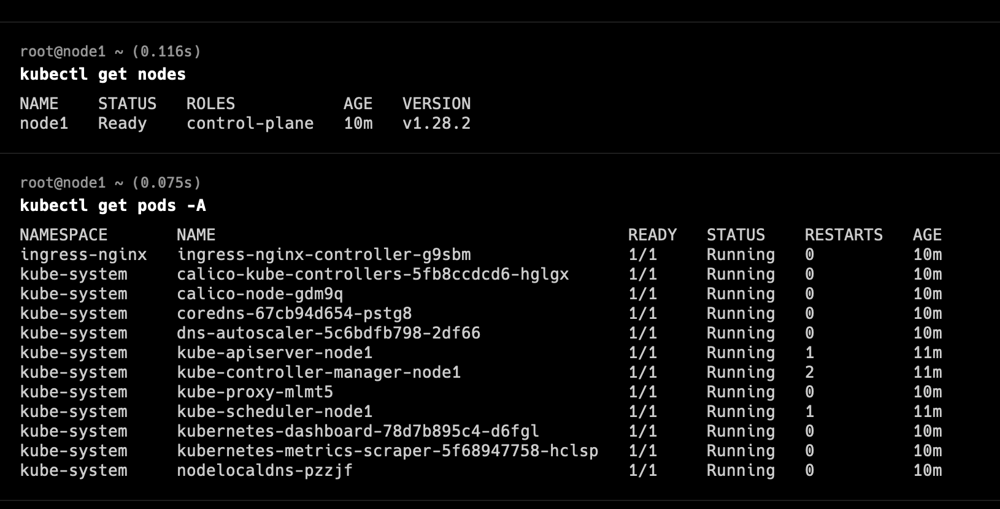

# kubernetes-kubespray-ansible

This repository is a tutorial how to create a Kubernetes cluster with Kubespray. Kubernetes cluster will have 2 controllers nodes and 2 workers nodes.
This will work on physical servers, virtual machines, AWS cloud, Google cloud, Scaleway cloud or any other cloud servers. This has been tested and verified on Ubuntu 22.04 Jammy Jellyfish operating systems. 

# WHAT IS KUBESPRAY?
Kubespray is an application that allows us to create kubernetes clusters by using ansible on our private servers or cloud servers (such as Scaleway).


# LAB Setup


## Step 1) Configure Kubespray/Ansible Node
Login to your Ubuntu 22.04 system and install ansible. Run the following set of commands:

```bash
sudo apt update
sudo apt install git python3 python3-pip -y
git clone https://github.com/kubernetes-incubator/kubespray.git
cd kubespray
pip install -r requirements.txt
```


Verify the ansible version, run
```bash
ansible --version

ansible [core 2.14.10]
  config file = /root/kubespray/ansible.cfg
  configured module search path = ['/root/kubespray/library']
  ansible python module location = /usr/local/lib/python3.10/dist-packages/ansible
  ansible collection location = /root/.ansible/collections:/usr/share/ansible/collections
  executable location = /usr/local/bin/ansible
  python version = 3.10.12 (main, Jun 11 2023, 05:26:28) [GCC 11.4.0] (/usr/bin/python3)
  jinja version = 3.1.2
  libyaml = True
```

Create the hosts inventory, run below commands and don’t forget to replace IP address that suits to your deployment.
```bash
cp -rfp inventory/sample inventory/mycluster
declare -a IPS=(10.196.84.69 10.19.72.7 10.196.100.21 10.196.116.3)
CONFIG_FILE=inventory/mycluster/hosts.yaml python3 contrib/inventory_builder/inventory.py ${IPS[@]}

DEBUG: Adding group all
DEBUG: Adding group kube_control_plane
DEBUG: Adding group kube_node
DEBUG: Adding group etcd
DEBUG: Adding group k8s_cluster
DEBUG: Adding group calico_rr
DEBUG: adding host node1 to group all
DEBUG: adding host node2 to group all
DEBUG: adding host node3 to group all
DEBUG: adding host node4 to group all
DEBUG: adding host node1 to group etcd
DEBUG: adding host node2 to group etcd
DEBUG: adding host node3 to group etcd
DEBUG: adding host node1 to group kube_control_plane
DEBUG: adding host node2 to group kube_control_plane
DEBUG: adding host node1 to group kube_node
DEBUG: adding host node2 to group kube_node
DEBUG: adding host node3 to group kube_node
DEBUG: adding host node4 to group kube_node
```

Modify the inventory file, set 1 control nodes and 2 worker nodes
```bash
vi inventory/mycluster/hosts.yaml
```


Save and close the file

Review and modify the following parameters in file “inventory/mycluster/group_vars/k8s_cluster/k8s-cluster.yml”.

```bash
kube_version: v1.26.2
kube_network_plugin: calico
kube_pods_subnet: 10.233.64.0/18
kube_service_addresses: 10.233.0.0/18
cluster_name: bachtiar.local
```

To enable addons like kuberenetes dashboard and ingress controller, set the parameters as enabled in the file “inventory/mycluster/group_vars/k8s_cluster/addons.yml”
```bash
$ vi inventory/mycluster/group_vars/k8s_cluster/addons.yml
-----------
dashboard_enabled: true
ingress_nginx_enabled: true
ingress_nginx_host_network: true
-----------
```

## Step 2) Copy SSH-keys from ansible node to all other nodes
First generate the ssh-keys for your local user on your ansible node,

```bash
ssh-keygen
```

Copy the ssh-keys using ssh-copy-id command,
```bash
ssh-copy-id sysops@10.196.84.69
ssh-copy-id sysops@10.19.72.7
ssh-copy-id sysops@10.196.100.21
ssh-copy-id sysops@10.196.116.3
```

Also run the following command on each node.

```bash
echo "sysops ALL=(ALL) NOPASSWD:ALL" | sudo tee /etc/sudoers.d/sysops
```

## Step 3) Disable Firewall and Enable IPV4 forwarding
To disable firewall on all the nodes, run following ansible command from ansible node,
```bash
d kubespray
ansible all -i inventory/mycluster/hosts.yaml -m shell -a "sudo systemctl stop firewalld && sudo systemctl disable firewalld"
```

Run following ansible commands to enable IPv4 forwarding and disable swap on all the nodes,
```bash
ansible all -i inventory/mycluster/hosts.yaml -m shell -a "echo 'net.ipv4.ip_forward=1' | sudo tee -a /etc/sysctl.conf"
ansible all -i inventory/mycluster/hosts.yaml -m shell -a "sudo sed -i '/ swap / s/^\(.*\)$/#\1/g' /etc/fstab && sudo swapoff -a"
```

## Step 4) Start Kubernetes deployment
Now, we are all set to start Kubernetes cluster deployment, run following ansible playbook from ansible node,
```bash
cd kubespray
ansible-playbook -i inventory/mycluster/hosts.yaml --become --become-user=root cluster.yml
```

## Step 5) Access Kubernetes cluster
Login to first master node, switch to root user, run kubectl commands from there,
```bash
kubectl get nodes
kubectl get pods -A
```


