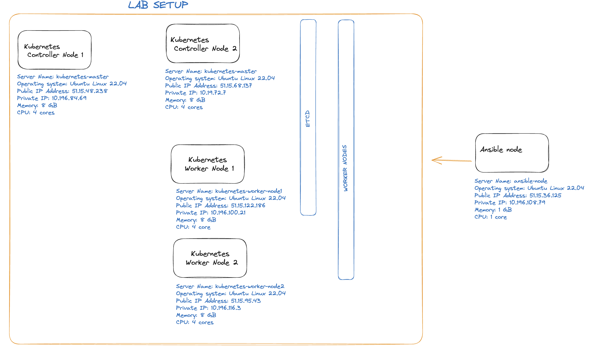

# kubernetes-kubespray-ansible

This repository is a tutorial how to create a Kubernetes cluster with Kubespray. Kubernetes cluster will have 1 master node and 2 workers nodes.
This will work on physical servers, virtual machines, AWS cloud, Google cloud, Scaleway cloud or any other cloud servers. This has been tested and verified on Ubuntu 22.04 Jammy Jellyfish operating systems. 

# WHAT IS KUBESPRAY?
Kubespray is an application that allows us to create kubernetes clusters by using ansible on our private servers or cloud servers (such as Scaleway).

# LAB Setup

